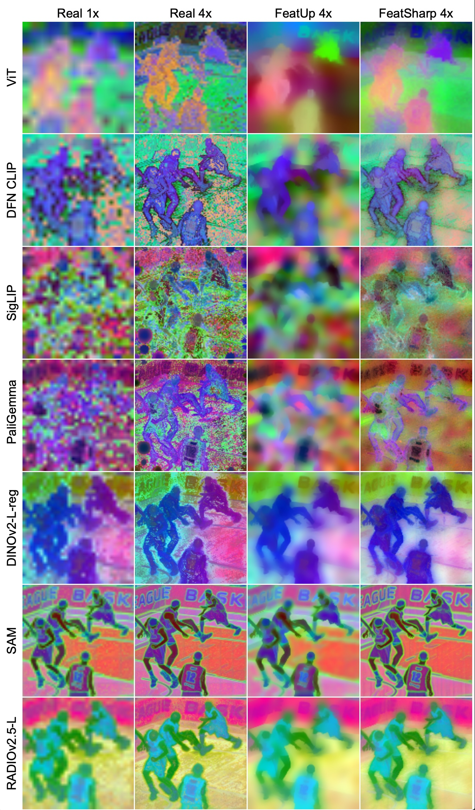

[](LICENSE)
[](https://openreview.net/pdf?id=lioemOcq3H)


# [ICML 2025] FeatSharp: Your Vision Model Features, Sharper

<!-- <div align="left"> -->

<!-- </div> -->

Official pytorch implementation of [FeatSharp: Your Vision Model Features, Sharper](https://openreview.net/pdf?id=lioemOcq3H)

Mike Ranzinger, Greg Heinrich, [Pavlo Molchanov](https://www.pmolchanov.com/), Bryan Catanzaro, Andrew Tao

[NVIDIA Research](https://www.nvidia.com/en-us/research/)

For business inquiries, please visit our website and submit the form: [NVIDIA Research Licensing](https://www.nvidia.com/en-us/research/inquiries/)

<br clear="left"/>

---

## News

- [6.1.2025] FeatSharp has been accepted to ICML 2025
- [5.1.2025] We've been experimenting with FeatSharp + RADIO for our next fleet of RADIO models. Stay tuned on https://github.com/NVlabs/RADIO for updates.

## Abstract

FeatSharp is a method of upsampling the features of vision foundation models that adheres as strictly as possible to what they theoretically might have produced, assuming they could run at the higher resolution. This is particularly advantageous for Vision Transformer (ViT) models where they tend to be resolution inflexible, and also low resolution (e.g. in the 224 to 448px range). FeatSharp helps work around this resolution limitation by learning to upsample via a multiview consistency formulation, where features that are consistent across viewpoints are preserved, and those that are not consistent are suppressed. We are now using this technique to train our latest RADIO models.

## Getting Started

### Datasets

This codebase is designed to run on systems that don't work well with small files, so the first step is to convert one or more image datasets into [webdataset](https://rom1504.github.io/webdataset/) format. For simple image libraries, this could be as simple as tarring all of the files into a single tarball. We don't use any form of GT in the data, so only the images are necessary. Place the tarfile(s) into a directory, and this is where you'll then point the training config to load. Refer to [featsharp/configs/datasets/default.yaml](featsharp/configs/datasets/default.yaml) for an example of how to define the datasets. In particular, we need three different groups of datasets:

- `train_data_dir` - This is a (potentially nested) directory full of webdataset tarfiles that contain the training images.
- `val_data_dir` - We use a handful of samples from this to render visualizations periodically during training. If you're experimenting with different training data blends, it's sometimes useful to keep the `val_data_dir` dataset static, so that it's easier to compare between runs.
- `dist_train_data_dir` - We use this to learn the dataset statistics for PHI-S. In general, it makes sense to keep this matching `train_data_dir`.

It's completely fine if all three groups point to the same data.

### Launch Configuration

We use [Hydra](https://hydra.cc/) to configure the experiments, as it allows us to modularly define an experiment configuration.

#### Artifacts

Artifacts (such as logs, checkpoints, etc.) will be stored in the path pointed to by `output_root` in the config. Ensure that you set a valid path for `output_base` in [featsharp/configs/base_config.yaml](featsharp/configs/base_config.yaml), and then by default, the outputs will follow `${output_base}/${output_subdir}` where each of the currently supported models will add their own `${output_subdir}` that helps organize the experiments. For example, [dinov2-l_448px.yaml](featsharp/configs/model/dinov2-l_448px.yaml) sets it to `dinov2/large/448`.

#### Visualization

The best way to visualize FeatSharp training is via [wandb](www.wandb.ai). You can set the entity and project in the base config. TensorBoard should also work, or you could extend with your own host by defining your own [VizWriter](featsharp/visualization.py), and add it to the `get_visualizer` function in the same [visualization.py](featsharp/visualization.py) file.

#### Training

Standard usage:
```
torchrun --nproc-per-node=<number of GPUs you have> featsharp/train.py +model=<which_model> +upsampler=<which_upsampler> num_training_steps=9000
```

As you can see, there are two major arguments that need to be supplied: `<which_model>` and `<which_upsampler>`. These can be found in [featsharp/configs/model/](featsharp/configs/model/) and [featsharp/configs/upsampler/](featsharp/configs/upsampler/) respectively. You don't need to supply the path to the config name, and also don't need to specify the file extension. So, an example full invocation of the training command looks like this:

```
torchrun --nproc-per-node=8 featsharp/train.py +model=siglip2 +upsampler=featsharp-4x num_training_steps=9000
```

#### Inference

Once trained, we provide an inference API that wraps the upsampler and the base vision encoder. It can be accessed via the [load_from_file](featsharp/builder.py#:~:text=load_from_file) function, where you supply the path to a checkpoint trained by this library, and it will return a vision encoder that produces upsampled outputs.

```
from featsharp.builder import load_from_file

venc = load_from_file('path/to/checkpoint/last.pth')

ups = venc(images, denormalize=True, return_summary=True)
```

Whether to `denormalize` depends on application. If `False`, then the results will be in PHI-S standardized space, where the expected standard deviation of each channel is roughly 1. If `True`, then the features will be approximately in the base vision encoder's distribution. Typically, you'd want to denormalize.

`return_summary` sets whether or not the summary token is returned. For most ViTs, this corresponds to the CLS token. FeatSharp doesn't do anything special to extract this token, rather, it's the result of running the model at low resolution, so don't expect improved quality through our system.

`images` are expected to be pre-whitened. You can get the whitening information with the `venc.input_conditioner` property. This roughly follows the `torchvision.transforms.Normalize` object, which you can place in your data preprocessing pipeline. The input to this normalize object is expected to have values between `[0, 1]`.

The output is an `UpsamplFeatures` structure:
```Python
class UpsampleFeatures:
    low_res: torch.Tensor  # The low resolution feature map (e.g. what the base featurizer produces), in BCHW format
    high_res: torch.Tensor # The high resolution features, as the result of feature upsampling, in BCHW format
    summary: torch.Tensor  # The summary token, will be None unless `return_summary` is set, in BC format
```

## Citing FeatSharp

```bibtex
@InProceedings{ranzinger2025featsharp,
    title={FeatSharp: Your Vision Model Features, Sharper},
    author={Mike Ranzinger and Greg Heinrich and Pavlo Molchanov and Bryan Catanzaro and Andrew Tao},
    booktitle={Forty-second International Conference on Machine Learning},
    year={2025},
    url={https://openreview.net/forum?id=lioemOcq3H}
}
```

## Licenses

Copyright © 2024, NVIDIA Corporation. All rights reserved.

This work is made available under the NVIDIA Source Code License-NC. Click [here](LICENSE) to view a copy of this license.
